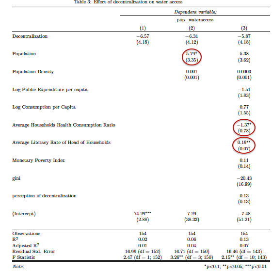
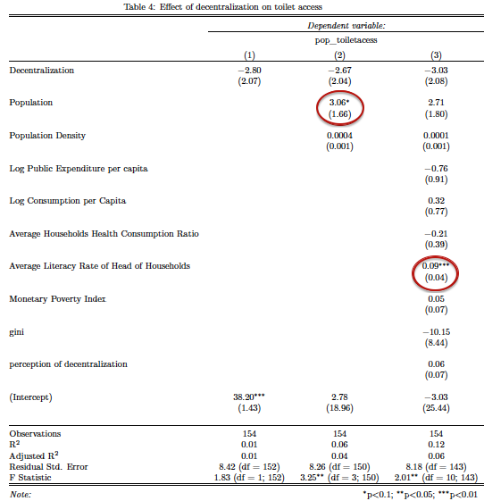
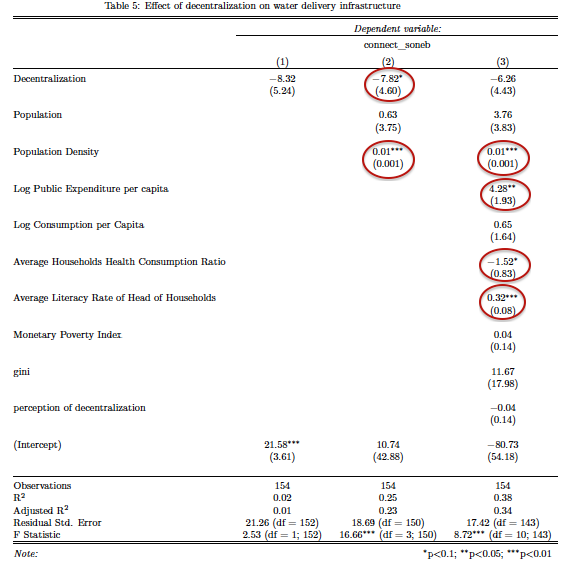
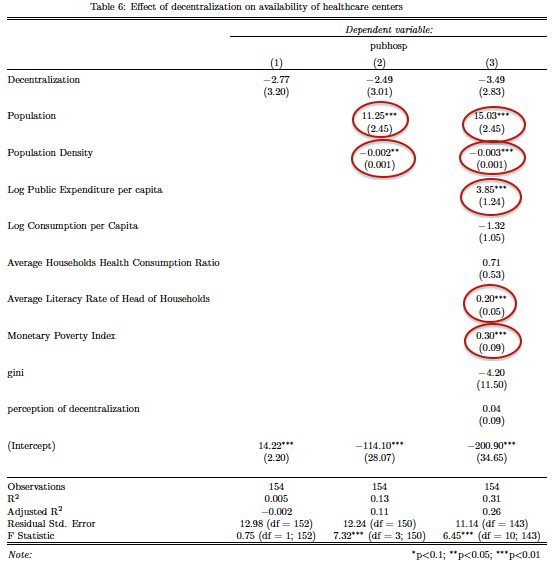

## Research Question

 **What impact does decentralization have on the performance of the health provision system in Benin?**
 
```{r,include=FALSE}
library(ggmap)
library(car)
library(ggplot2)
library(RCurl)
library(gvlma)
library(robust)
library(het.test)
library(stargazer)
```

```{r, echo=FALSE, message=FALSE}
Country_Benin<-qmap(location='benin',zoom=6)
print(Country_Benin)
```


## Description of Benin


- GDP per capita: USD 804.67 in 2013

- GDP growth: 5.6% in 2013

- Population: 10.32 million habitants 

- Human Development Index 2014: 165 out of 187 countries 


##Why Benin?


- Decentralization and devolution have been at the center of national policy for the past decade

- Decentralization: huge transformation of the political and administrative organization

- Decentralization as mechanism to fight poverty and reduce inequality

- Legal provisions has transfered part of health provision competencies to subnational entities 

- Subnational governments have tax raising powers and are allocated transfers to meet assigned expenditures


## Theoretical background

Proponents of decentralization share the view that local governments are the major vehicles for specific poverty alleviation policies. 

<div class="blue2">
**Economic Theory**
</div>

- decision-making should occur at the lowest level of government --> allocation efficiency  [@shah1994reform] 

- local government has an informational advantage  [@oates1972fiscal]

- decentralization --> greater participation of nearby communities --> accountability of policymakers [@crook1998democracy]  [@tiebout1956pure]

## Empirical Findings 

<div class="blue2">
**Pros**
</div>

- [@santos2005participatory] (Brazil): Decentralization has contributed to double the level of access to basic sanitation and enrollment in elementary schools between 1989 and 1996. Revenue collection increased by 48%. 

- [@bardhan2000capture]: (West Bengal): Fiscal autonomy of local governments expands the volume of service delivery 

- [@faguet2004does] (Bolivia): Public investment in education, water and sanitation rose significantly 

- [@bird1999decentralization] (Asian and Latin-America): Positive effect of decentralization on health, primary education and infrastructure.

---


<div class="blue2">
**Cons**
</div>


- [@reinikka2004local] (Uganda): Capture of decentralized school grants by local officials in Uganda. 

- [@treisman2000causes]: (developing countries): more levels of government induce higher perceived corruption, less effective provision of public health services 

- [@del2008local] (Indonesia): decentralization leads to yardstick competition between local governments 


## Methodology and Exploratory Data Collection 

<div class="blue2">
**Macroeconomic approach**
</div>

Given that health related services is highly decentralized, there might be a strong correlation between the macro-overview and the microeconomic outcome.

- country's health-related public expenditures (WB, WHO) 

- improved sanitation facilities on a macro level


## Macro overview
```{r, include=FALSE}
library(WDI)
healthpublicexpend<-WDI(indicator= c('SH.XPD.PUBL','SH.XPD.PCAP','SH.STA.ACSN'))
Benin<-subset(healthpublicexpend,country=='Benin')
Benin$iso2c<-NULL
names(Benin)[names(Benin)=="year"] <- "Year"
names(Benin)[names(Benin)=="SH.XPD.PUBL"] <- "Public.Health.Expenditure"
names(Benin)[names(Benin)=="SH.XPD.PCAP"] <- "Health.Expenditure.Per.Capita"
names(Benin)[names(Benin)=="SH.STA.ACSN"] <- "Improved.Sanitation.Facilities"

```

```{r,include=FALSE}
infrastructures <- read.csv("http://apps.who.int/gho/athena/data/data-text.csv?target=GHO/DEVICES01,DEVICES02,DEVICES03,DEVICES04,DEVICES05&profile=text&filter=COUNTRY:*;REGION:AFR;REGION:AMR;REGION:SEAR;REGION:EUR;REGION:EMR;REGION:WPR")
Benininfra<-subset(infrastructures,Country=='Benin')
Benininfra$PUBLISH.STATES<-NULL
Benininfra$WHO.region<-NULL
Benininfra$Low<-NULL
Benininfra$High<-NULL
Benininfra$Comments<-NULL
library(dplyr)
messy<-data.frame(
  Indicator=c("District/rural hospitals", "Health centres","Provincial hospitals","Specialized hospitals","Provincial hospitals","Specialized hospitals"),
  Year=c(2010,2010,2010,2010,2013,2013),
  Country=c("Benin","Benin","Benin","Benin","Benin","Benin"),
  Display.Value=c(0.29,6.36,0.06,0.12,0.05,0.11)
  )
library(tidyr)
tidy<-spread(messy,Indicator,Display.Value)
```

```{r, include=FALSE}
names(Benin)[names(Benin)=="country"] <- "Country"
total<-merge(Benin,tidy, by=c("Country","Year"),all=TRUE)
```

```{r,include=FALSE, message=FALSE}
library(googleVis)
```

```{r,include=FALSE, results='asis'}
compare_trend <-data.frame(
  Year=c("2005","2006","2007","2008","2009","2010","2011"),
  Public.Health.Expenditure=c(49.69487,50.22141,50.75158,50.95043,53.35198,51.16728,52.10150),
  Health.Expenditure.Per.Capita=c( 25.21300,26.47114,28.77537,31.01608,31.80012,30.47805,33.73303),
  Improved.Sanitation.Facilities=c(11.2,11.7,12.2,12.7,13.2,13.7,14.2))
```

```{r,echo=FALSE, results='asis'}
line_plot <- gvisLineChart((compare_trend), 
              options=list(
                        title="Compare trends",
                        titleTextStyle="{color:'black', 
                                           fontName:'Courier', 
                                           fontSize:16}",   
                          curveType="function",
                          width=800,
                          height=500                         
                          )) 
print(line_plot, tag = 'chart')
```


## Micro analysis


**Estimated Model**

<div class="red2">
$$ D_{it} = \alpha + \beta_{1}Decentralization_{it} + X\beta_{} + e $$
</div>

**Independent variable** : Decentralization

```{r,include=FALSE, message=FALSE}
url2 <- "https://raw.githubusercontent.com/giumin/Third_Assignment/gh-pages/decenthealth.csv"
combineddata.data <- getURL(url2, ssl.verifypeer = FALSE)                
combineddata.data <- read.csv(textConnection(combineddata.data))
```
**Dependent variables**: access to water, access to toilet facilities, water provision infrastructure,healthcare centers (hospitals)  


**Explanatory variables**: population, population density, per/c consumption, public expenditure per/c, health consumpt.(per head of house), monetary poverty index, average literacy rate, gini  


##Impact on Water Access



##Impact on Access to toilet facilities



##Impact on provision of water facilities


##Impact on provision of public healthcare facilities



##References


